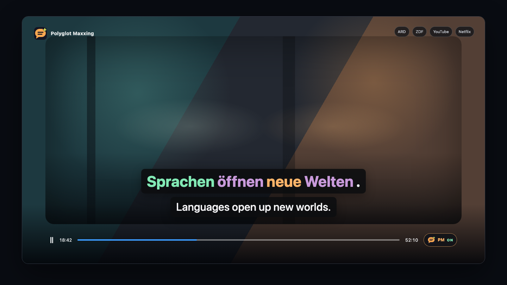
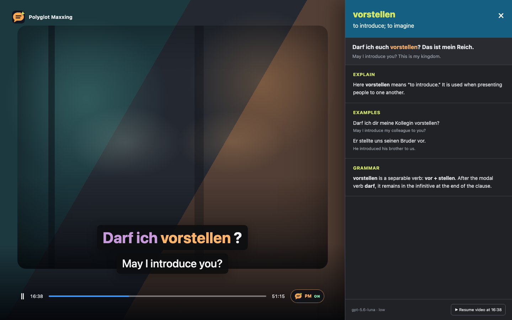
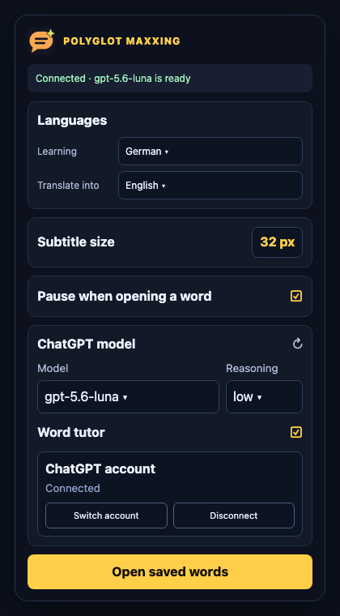
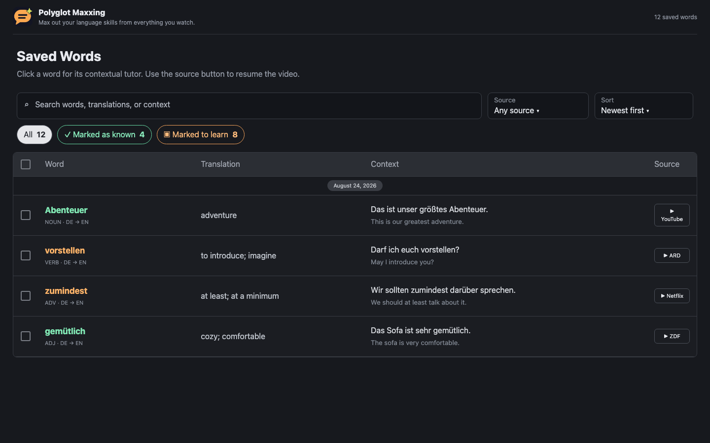

<p align="center">
  
</p>

<h1 align="center">Polyglot Maxxing</h1>

<p align="center"><strong>Max out your language skills from everything you watch.</strong></p>

Polyglot Maxxing is an open-source, local-first Chromium extension for dual
subtitles, contextual word explanations, and vocabulary learning. It currently
supports ARD Mediathek, ZDF, YouTube, and Netflix.

German → English is the default, but the learning and translation languages are
selectable. Subtitle translation and word tutoring use a Codex model through an
attached ChatGPT account; saved words, translations, and caches remain on your
computer.



## Features

- German and translated subtitles displayed together inside the video player,
  including fullscreen mode.
- Timed subtitle-track extraction and seek-aware prefetching in 24-cue batches.
- Clickable words with streamed Explain, Examples, and Grammar sections.
- Right-click learning/known status and a searchable Saved Words page with
  timestamped links back to the video.
- Selectable source language, target language, Codex model, reasoning effort,
  and subtitle size.
- SQLite persistence and optional local German analysis/dictionary data.

## Product tour

| Contextual word tutor | Extension settings |
| --- | --- |
|  |  |



## How it works

```text
ARD / ZDF / YouTube / Netflix
        ↓
Chromium extension: subtitle discovery, synchronization, and UI
        ↓  http://127.0.0.1:8765
FastAPI companion: Codex requests, analysis, cache, and vocabulary
        ↓
Attached ChatGPT account through the Codex SDK
```

The companion binds only to loopback. There is no OpenAI API-key setup and no
local translation-model fallback.

## Requirements

- Docker Desktop
- Node.js 20 or newer
- Chrome, Helium, Edge, or another Chromium browser that can load unpacked
  extensions
- A ChatGPT account with Codex access

`uv` and Python 3.12 are needed only for native server development.

## Setup

### 1. Start the companion

```bash
git clone git@github.com:imehsanullah/polyglot-maxxing.git
cd polyglot-maxxing
cp .env.example .env
docker compose up --build -d
```

Verify the service:

```bash
curl http://127.0.0.1:8765/health
```

Persistent application data is stored in `./data` by default. Set
`POLYGLOT_MAXXING_DATA_DIR` in `.env` to use another directory. Never commit or
share that directory; it contains the SQLite database and Codex login state.

### 2. Install the extension

Download and unzip the Chrome bundle from
[GitHub Releases](https://github.com/imehsanullah/polyglot-maxxing/releases), or
build it from source:

```bash
npm install
npm run build:extension
```

Open your browser's extensions page, enable Developer mode, choose **Load
unpacked**, and select:

```text
apps/extension/.output/chrome-mv3
```

After pulling updates, rebuild the extension, press **Reload** on its browser
extension card, and refresh open video tabs.

### 3. Connect ChatGPT

1. Open the Polyglot Maxxing popup.
2. Select **Connect ChatGPT account**.
3. Enter the displayed device code on the authorization page that opens.
4. Reopen the popup after authorization and select a model and reasoning effort.

The model list comes from the attached account. You can disconnect or switch
accounts from the same popup.

## Usage

1. Choose the language you are learning and the translation language in the
   popup.
2. Open a supported video with a subtitle track in the learning language.
3. Use the **PM** control in the player to enable or disable Polyglot Maxxing.
4. Use the adjacent language control to override the defaults for one video.
5. Hover a word for a quick summary, click for the contextual tutor, or
   right-click to change its learning status.
6. Open **Saved words** from the popup to search vocabulary and resume videos at
   saved timestamps.

When a video does not provide the selected subtitle language, the player shows
the available track languages. Polyglot Maxxing does not translate a different
source track silently.

## Supported subtitle sources

- **ARD:** embedded WebVTT or the ARD media-collection endpoint.
- **ZDF:** player metadata and the requested WebVTT track.
- **YouTube:** human captions first, then automatic captions in the requested
  language when available.
- **Netflix:** the signed timed-text document from the active playback session,
  with rendered captions as a temporary fallback.

Polyglot Maxxing does not bypass authentication, subscriptions, region limits,
DRM, or unavailable videos. Streaming sites can change their internal player
interfaces, so adapters may occasionally need maintenance.

## Development

Extension:

```bash
npm run test:extension
npm run typecheck:extension
npm run build:extension
```

Companion:

```bash
cd apps/polyglot-maxxing-server
uv sync --extra dev --extra nlp --extra codex
uv run pytest
uv run polyglot-maxxing-server
```

Native German Stanza setup:

```bash
uv run python -c "import stanza; stanza.download('de', processors='tokenize,pos,lemma')"
```

The Docker image already includes the German Stanza resources. Other languages
use safe Unicode tokenization unless a matching local analyzer is installed.

## Optional offline dictionary

From `apps/polyglot-maxxing-server`, install the verified FreeDict/Ding
German-English dictionary:

```bash
uv run python scripts/install_freedict.py
```

Or import an English Wiktionary Wiktextract JSONL/JSONL.GZ file from Kaikki:

```bash
uv run python scripts/build_dictionary.py /path/to/kaikki-data.jsonl.gz
```

Dictionary datasets are downloaded separately and are not part of this
repository. Their licenses apply independently.

## Configuration

| Variable | Default | Purpose |
| --- | --- | --- |
| `POLYGLOT_MAXXING_DATA_DIR` | `./data` | Docker data directory |
| `POLYGLOT_MAXXING_HOST` | `127.0.0.1` | Native companion bind address |
| `POLYGLOT_MAXXING_PORT` | `8765` | Companion port |
| `POLYGLOT_MAXXING_CODEX_TRANSLATION_MODEL` | `gpt-5.6-luna` | Initial translation model |
| `POLYGLOT_MAXXING_CODEX_TRANSLATION_EFFORT` | `low` | Initial reasoning effort |
| `POLYGLOT_MAXXING_CODEX_TRANSLATION_TIMEOUT_SECONDS` | `90` | Subtitle-batch timeout |
| `POLYGLOT_MAXXING_CODEX_TIMEOUT_SECONDS` | `90` | Word-tutor timeout |
| `POLYGLOT_MAXXING_CODEX_CONCURRENCY` | `2` | Maximum concurrent Codex turns |
| `POLYGLOT_MAXXING_ENABLE_STANZA` | `1` | Enable installed Stanza models |

## Privacy

Vocabulary, dictionary data, authentication state, and caches are stored
locally. Subtitle cues and their immediate context are sent to the selected
Codex model for translation. Opening a word also sends that word, its subtitle
context and translation, and available token metadata for tutoring.

## License

Polyglot Maxxing is released under the [MIT License](LICENSE). Downloaded
dictionary datasets retain their own licenses.
